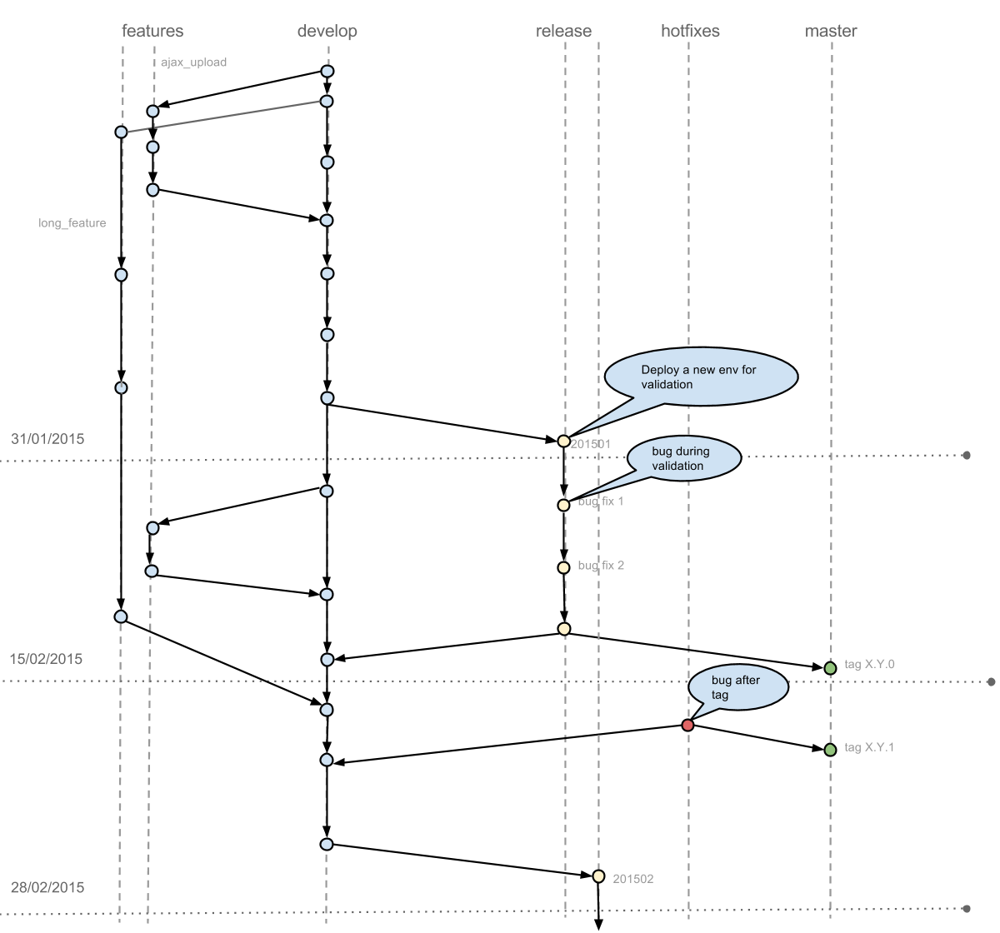

#Git guidelines

## Table of Contents
  1.  [Introduction](#introduction)
  1.  [Commit message format](#commit-message-format)
      1. [Type](#type)
      1. [Scope](#scope)
      1. [Subject](#subject)
      1. [Body](#body)
      1. [Footer](#footer)
  1.  [Flow](#flow)
      1. [Features](#features)
      1. [Review](#review)
      1. [Release](#release)
      1. [Hotfix](#hotfix)
      1. [Commits](#commits)
  1.  [Example](#example)


##Introduction

It's important that everybody follow the same rules about git commit messages.
This leads to easy-to-read messages and open the ability to automatically generate a changelog, based on this commit.

This doesn't mean that we won't have developer informations anymore like link to the redmine task ; there is a part for it. But lambda user should be able to read the log and understand what has been done.

This is not a brand new format, it's pretty much standard and has been adopted by Angular for example.

##Commit Message Format

Each commit message consists of a `header`, a `body` and a `footer`. The `header` has a special format that includes a type, a scope and a subject:

```sh
<type>(<scope>) : <subject>
<BLANK LINE>
<body>
<BLANK LINE>
<footer>
```

Any line of the commit message cannot be longer 100 characters.
This allows the message to be easier to read on web platform like github or gitlab as well as in various git tools.

###Type

Must be one of the following:

- **feat** :     A new feature
- **fix** :      A bug fix
- **docs** :     Documentation only changes
- **style** :    Changes that do not affect the meaning of the code (white-space, formatting, missing semi-colons, etc)   
- **refactor** : A code change that neither fixes a bug or adds a feature
- **perf** :     A code change that improves performance
- **test** :     Adding missing tests
- **chore** :    Changes to the build process or auxiliary tools and libraries such as documentation generation
- **content** :  Add content

It doesn't mean a feature can't contain tests or docs, in fact it should. We use test type when we commit test-only code.

###Scope

Before using scope, we have to define scopes of the application and store them in the documentation folder. 
By scope we mean an application part, not a technical part, for exemple search, add to cart, API...

###Subject

The subject contains succinct description of the change:

* use the imperative, present tense: "change" not "changed" nor "changes"
* don't capitalize first letter
* no dot (.) at the end

###Body

Same rules as for the subject.
The body should include the motivation for the change and be more detailled than the subject.

###Footer

The footer should contain any information about Breaking Changes and is also the place to reference GitHub, Gitlab, Redmine issues that this commit Closes.

##Flow

We must follow git-flow model as much as possible.



###Features

Every feature should be develop in his own branch. Before merging it, each branch has to be reviewed. Once done, it's merged into develop.

It is not possible to merge feature in the monthly branch after the last day of this month. If a feature is not finished it will be merged in the next monthly sprint.

Monthly branch will be automatically deployed on a dedicated environment. This is true for every applications.

A feature can last many sprints. A milestone is a set of features which take X (X is an integer) sprints resulting in a version x.y.z where z is always 0.

###Review

Review should ensure that the code is working and respect this document guidelines (workflow + code style).

We should write some hooks to check the basics and later ensure that our CI will reject commit resulting in failing tests.

###Release

At the end of each month a release branch is created, based on develop. It contains finished work.

Work in progress must continue in there feature branch. Once the release branch has been created, an env is deployed for this release.
Business starts validated the work on the dedicated env, for example 201501.validations.valipat.be.

They reports bugs that are fixed directly on the release branch and merged back in develop. Once everything is fine we merge the release in master and develop and add a tag.

We use semver so the tag correspond to a x.y.0 version.

###Hotfix

If we found bug after tagging the release we must fix it using a hotfix. Hotfix has to be apply on both develop and master.

We tag version incrementing z, for example x.y.1.

###Commits

Commit should be as contextual an atomic as possible. Following the previous rules, it's not possible to mix a feature with a refactoring. Otherwise if we have 3 commits to implement something they may be squashed.

We assume that every developer works alone in his feature branch. So he will be able to rewrite git log using interactive rebase. It's very uncommon that you don't have to rebase before merging your feature. Keeping a clean log is really important.

##Example

`git-flow` comes with a tool to easily manage this workflow. 

```sh
brew install git-flow
```

oh-my-zsh also has a plugin to quick completion.

```sh
git flow init

Initialized empty Git repository in /Users/name/tmp/app/.git/ No branches exist yet. 
Base branches must be created now. 
Branch name for production releases: [master]
Branch name for "next release" development: [develop]
How to name your supporting branch prefixes? Feature branches? [feature/]
Release branches? [release/]
Hotfix branches? [hotfix/]
Support branches? [support/] Version tag prefix? []
Your current branch will be develop. We can start a new feature.

git flow feature start ajax_upload
```

I write some code and commit.

```sh
commit 7aa4eae61103fa9c4467a2e0af73bc2e62479424
Author: John Doe <jdoe@site.com>
Date:   Tue Dec 30 15:28:27 2014 +0100
    feat(upload): add ability to upload file without reload
    customer were previously redirecting to upload their files. They are now
    able to send file async using AJAX
fixes #137
commit cce8073a3eafbbcc46435b7c68a10738d8c6c8c5
Author: John Doe <jdoe@site.com>
Date:   Tue Dec 30 15:25:54 2014 +0100
    Initial commit
```

Once my feature has been reviewed I can close my feature.

```sh
git flow feature finish ajax_upload
``

outputs:

```sh
Switched to branch 'develop' Updating cce8073..7aa4eae Fast-forward
ajax.rb | 0
1 file changed, 0 insertions(+), 0 deletions(-) create mode 100644 ajax.rb
Deleted branch feature/ajax_upload (was 7aa4eae).
```


Summary of actions:
- The feature branch `feature/ajax_upload` was merged into `develop` - Feature branch `feature/ajax_upload` has been removed
- You are now on branch `develop`


Now we are at the end of the month, I create my release from develop.

```sh
git flow release start 201501
```

then pushed it:

```sh
git flow release publish 201501
```

and deploy my new env. During validation users find a bug and report it.

```sh
commit cb12ba362788e15bfb23fd286913fb32037a9d76
Author: John Doe <jdoe@site.com>
Date:   Tue Dec 30 15:35:30 2014 +0100

fix(upload): change the way we handle upload for IE6
IE6 doesn't support XMLHttpRequest, we fallback to ActiveXObject

fix #4242
```

Now the release seems good, we can close it.

```sh
git flow release finish -n 201501
```

It will produce a merge commit, then the release will be merge into master and develop and the branch will be destroyed.

We use -n because we want to use a semantic versionning for tag, like 1.2.0 not 201501.

```sh
git tag 1.2.0
```

Once our app tagged, we will deploy it to production but argh, we encounter a security issue.

```sh
git flow hotfix start 1.2.1
```

We fix it:

```sh
commit cc7bcf5357bda6b1262c03508b70927382c1af68
Author: John Doe <jdoe@site.com>
Date:   Tue Dec 30 16:00:44 2014 +0100
    fix(upload): security issue when uploading .sh files
    server try to execute content of uploaded scripts

    fix #5105
```

Then we apply the hotfix:

```sh
git flow hotfix finish 1.2.1
```

It will be merged into master and develop, add a tag 1.2.1 and the branch will be removed.
